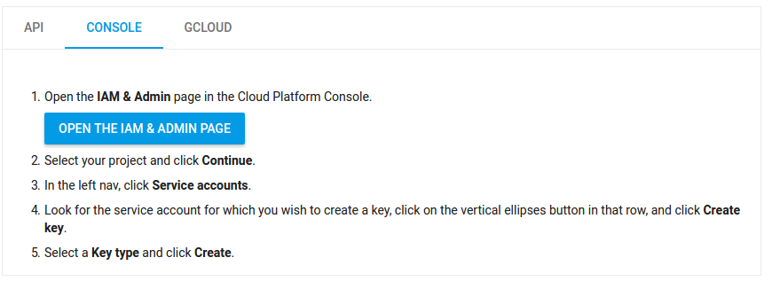

# Continuous Integration using Bitrise

1. Register Bitrise account and login, then add new app and configure it

  1.1. Select repo you want to sync with bitrise  
  1.2. Add Bitrise ssh-key to your github account  
  1.3. Choose branch for scanning  
  1.4. Pass through repo validation (may skip warnings)  
  1.5. Select project build configuration and platform  

2. Set up your Bitrise deployment workflow

  2.1. You can find android workflow examples in ``resources`` dir.  
  2.2. You can use Bitrise app signing and deployment for staging (and for Bitrise service testing) because it don't need additional Google Services integration  
  2.3. [Configure auto apk signing](http://devcenter.bitrise.io/android/code-signing/) - upload ``upload-keystore`` to Bitrise and use it as Env-variable.  

3. Connect Bitrise building process with Google Play Console for production

  3.1 Hardest part is setting up `google-play-deploy` step. Here you should [get](https://cloud.google.com/iam/docs/creating-managing-service-account-keys) `service account key` from Google Cloud Platform (use console step way)
  
  3.2 Enable APIs and Services on [this page](https://console.developers.google.com/apis/dashboard) for created project  
  3.3 Get your own `Google Service Account Json Key` and upload it to [Bitrise generic storage](http://devcenter.bitrise.io/tutorials/how-to-use-the-generic-file-storage/) for better privacy and use it in yml as `Bitrise Environment variable`
